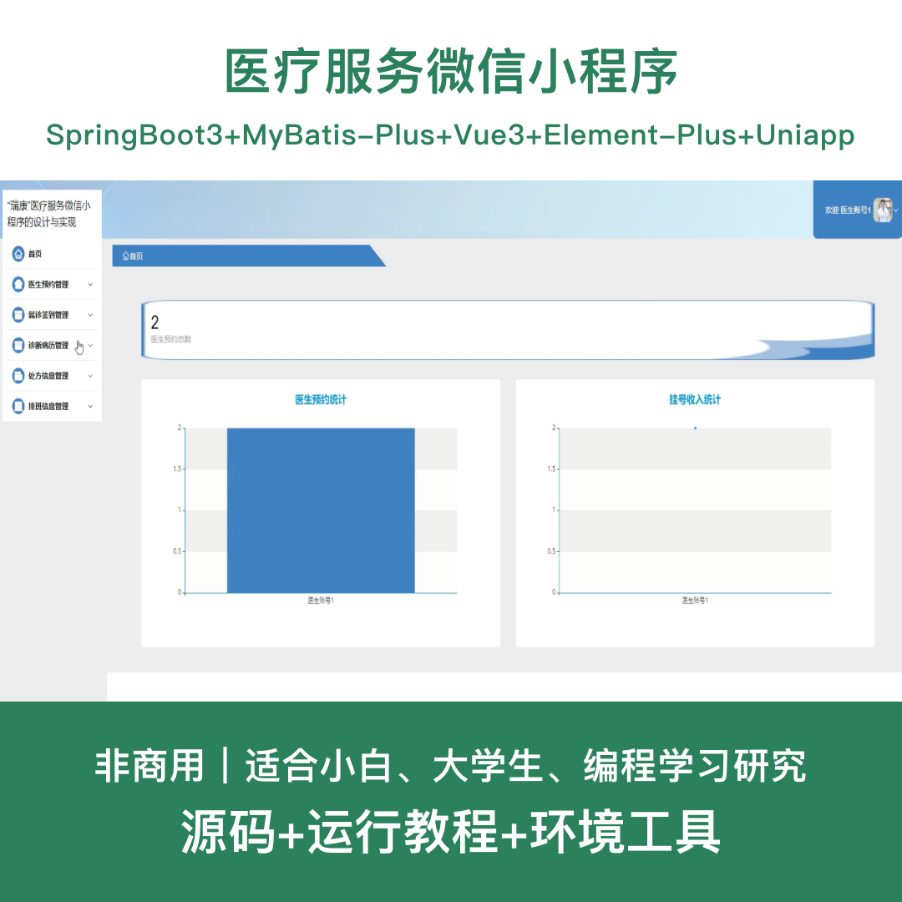
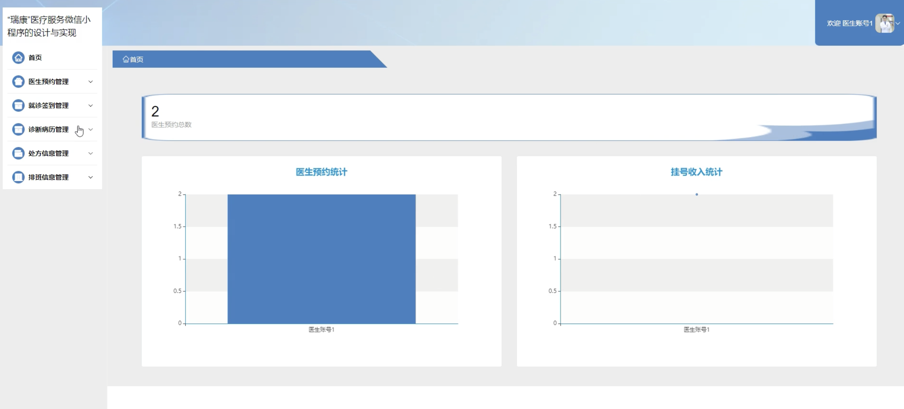
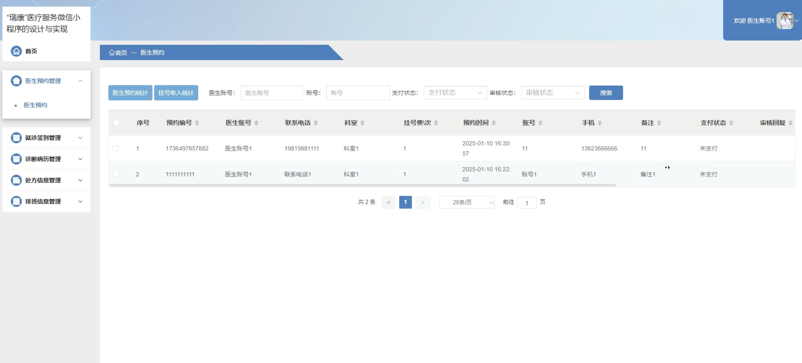
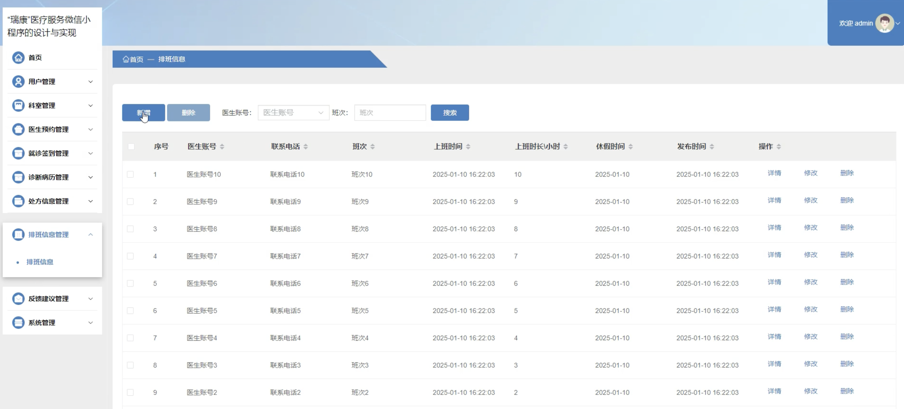
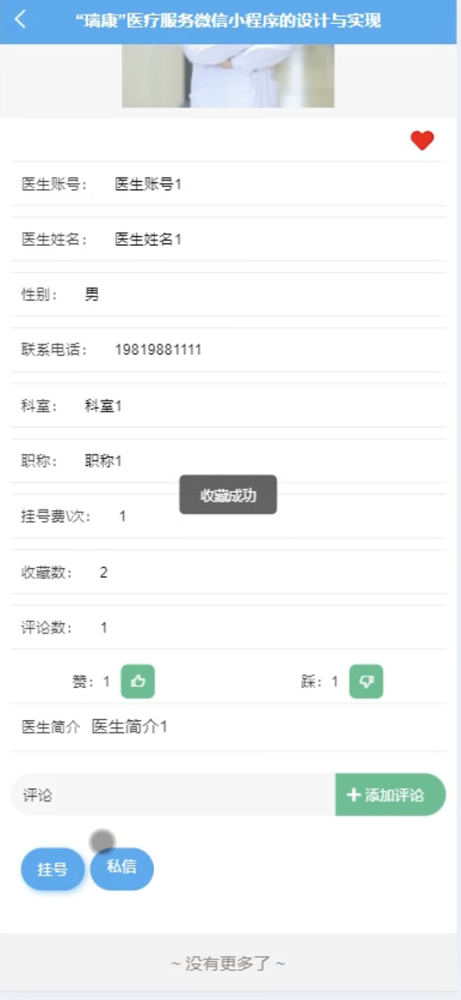
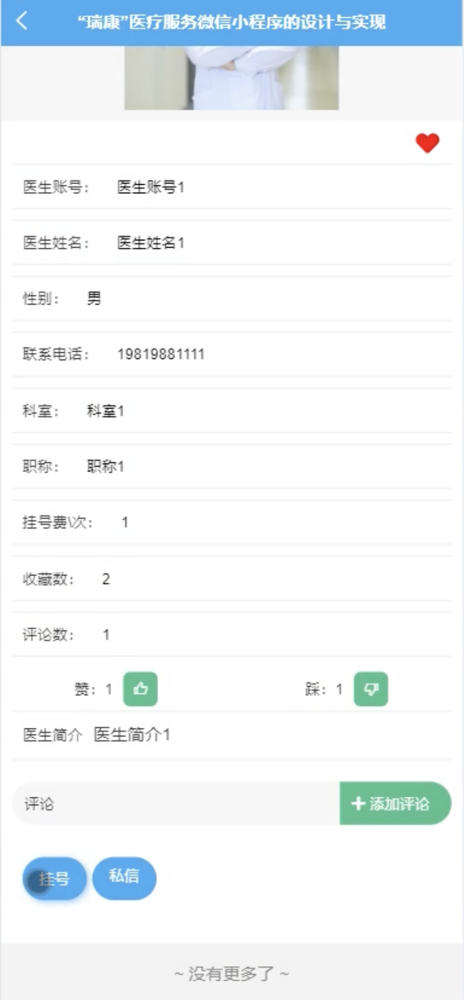
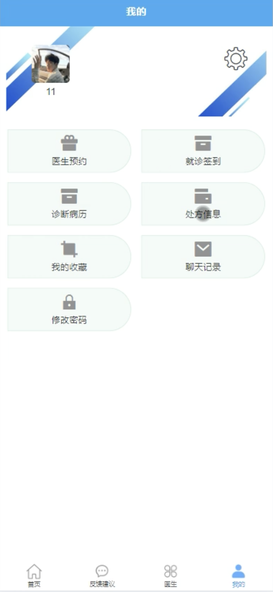
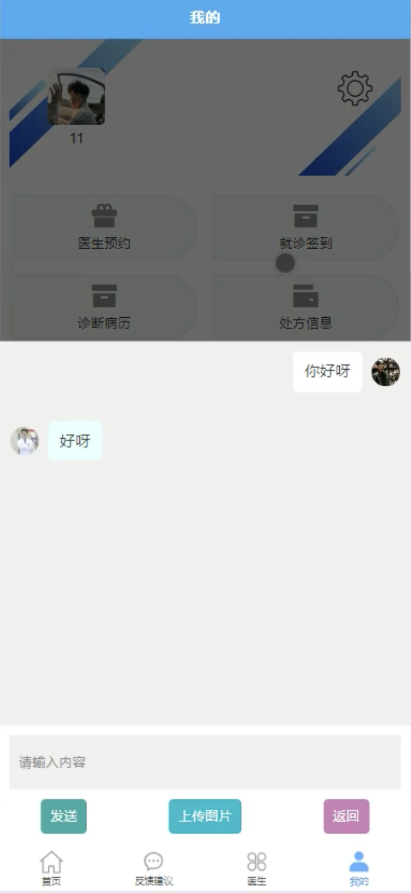

# mpweixinA240D
mpweixinA240D医疗服务微信小程序
 
## 源码问题查看主页咨询

### 一、关键词
医疗服务系统、医院挂号系统、在线问诊系统、健康管理系统、预约就诊系统

### 二、作品包含
源码+数据库+全套环境和工具资源+本地部署教程

### 三、项目技术
前端技术： Html、Css、Js、Vue3.2、Element-Plus、uniapp
后端技术：Java、SpringBoot3.3.0、MyBatis-Plus

### 四、运行环境（以下版本亲测，其他版本兼容性请自行测试）
开发工具：IDEA/eclipse + VSCODE + HBuilder X + 微信开发者工具

数据库：MySQL 8.0+

数据库管理工具：Navicat10以上版本

环境配置软件： JDK17 + Maven3.6+

前端Nodejs：16+

浏览器：谷歌浏览器

### 五、项目介绍
项目编号：mpweixinA240D

基于微信小程序的"瑞康"医疗服务系统，为患者提供便捷的在线预约挂号、医生咨询、就诊签到等一站式医疗服务，提升医疗服务效率和患者就医体验。

角色：管理员、用户、医生

用户功能：注册登录、医生查询、在线预约、就诊签到、查看处方、查看病历、医生聊天、个人中心。

医生功能：登录、预约管理、处方开具、病历记录、排班管理、患者咨询、个人中心。

管理员功能：登录、用户管理、医生管理、科室管理、预约管理、处方管理、病历管理、排班管理、系统配置。

数据库表共18张。

### 六、运行截图

